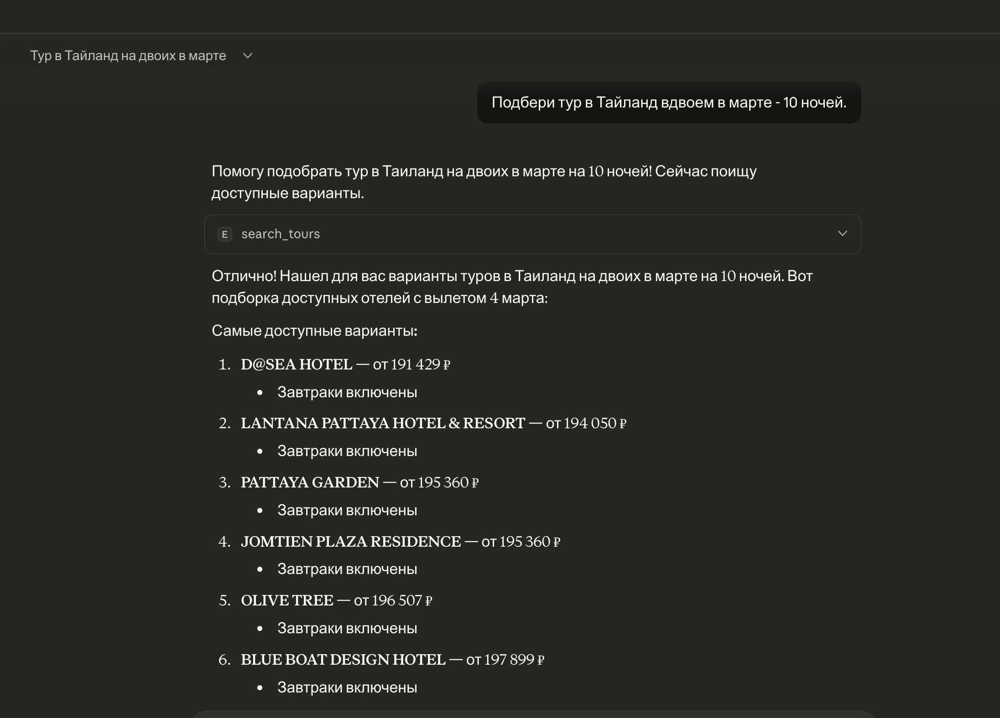

# eto-tours-mcp

Минимальный MCP‑сервер и HTTP‑адаптер для поиска туров через Tourvisor (modsearch/modresult).
Без Puppeteer, без cookies в коде, только обычные HTTP‑запросы.

Цель: дать нейросети доступ к поиску туров через MCP (stdio или HTTP/SSE) и/или обычный HTTP API.

## Что умеет
- Один MCP‑инструмент `search_tours`
- Цикл: `modsearch → poll modresult → дождаться data.block`
- Нормализованный результат: цена, дата, ночи, оператор, отель
- Названия отелей подтягиваются из `listdev.php` (если есть session/referrer/cookie)

## Демо


## Структура
- `api.py` — HTTP API (FastAPI) для modsearch/modresult и `search_tours`
- `mcp_server.py` — MCP сервер (stdio)
- `mcp_http.py` — MCP HTTP/SSE транспорт (если доступен в пакете `mcp`)
- `eto_client.py` — клиент для modsearch/modresult + нормализация
- `config.py` — настройки через env
- `api-contract.md` — фиксированный контракт с Tourvisor

## Быстрый старт

1. Установка зависимостей
```bash
python3 -m venv .venv
.venv/bin/pip install -r requirements.txt
```

2. Настроить `.env` (смотри `.env.example`)

3. Запуск HTTP API
```bash
.venv/bin/uvicorn api:app --host 0.0.0.0 --port 8080
```

4. Запуск MCP (stdio)
```bash
.venv/bin/python mcp_server.py
```

5. Запуск MCP по HTTP (если поддерживается транспорт)
```bash
.venv/bin/python mcp_http.py
```

## MCP инструмент
`search_tours` принимает:
- `country` — id или строка (например, `Египет`)
- `city_from` — id или строка (например, `Москва`)
- `date_from`, `date_to` — `YYYY-MM-DD`
- `nights` — количество ночей
- `adults` — количество взрослых
- `limit` — максимум туров (по умолчанию 20)
- `unique_hotels` — если `true`, отдаёт по одному туру на отель
- `refresh_hotels` — если `true`, обновляет список отелей из `listdev.php`
- `session`, `referrer` — если нужно переопределить

Пример запроса:
```json
{
  "date_from": "2026-03-01",
  "date_to": "2026-03-31",
  "nights": 10,
  "adults": 2,
  "country": "Египет",
  "city_from": "Москва",
  "limit": 10
}
```

Пример ответа:
```json
[
  {
    "hotel_id": 9366,
    "hotel_name": "SOME HOTEL",
    "operator": 16,
    "operator_name": "Sunmar",
    "date": "2026-03-02",
    "nights": 10,
    "price": 105782,
    "room": 30,
    "room_name": "standard",
    "meal": 3,
    "meal_name": "BB - Только завтрак"
  }
]
```

## HTTP API
- `POST /modsearch` — прокси на modsearch
- `GET /modresult?requestid=...` — прокси на modresult
- `POST /modresult` — прокси на modresult (requestid можно в теле)
- `POST /search` — алиас modsearch
- `GET /result` — алиас modresult
- `POST /search_tours` — полный цикл (modsearch → poll modresult → дождаться data.block)

`/search_tours` возвращает **нормализованный список туров**, а не сырой JSON Tourvisor.

## Публичные эндпоинты (деплой)
- HTTP API: `http://82.202.138.25:8080`
- MCP HTTP/SSE: `http://82.202.138.25:8081`

Пример:
```bash
curl -X POST http://82.202.138.25:8080/search_tours \
  -H 'Content-Type: application/json' \
  -d '{"country":"Египет","city_from":"Москва","date_from":"2026-03-01","date_to":"2026-03-31","nights":10,"adults":2,"limit":5}'
```

## Где взять session / cookie / referrer
Чтобы получить названия отелей через `listdev.php`, нужны актуальные `session`, `referrer` и cookie.

1. Открой `https://tourvisor.ru/`
2. DevTools → Network → XHR
3. Найди запрос:
```
listdev.php?type=allhotel&hotcountry=...&format=json&referrer=...&session=...
```
4. Скопируй:
   - query параметр `session`
   - query параметр `referrer`
   - cookie из заголовка `Cookie`

Эти значения положи в `.env`:
- `DEFAULT_SESSION`
- `DEFAULT_REFERRER`
- `ETO_HEADERS_JSON` (внутри `Cookie` и `Referer`)

Важно:
- Не коммить `.env` в git
- Сессии со временем устаревают, можно обновлять без перезапуска кода

## Клиенты MCP (кроме Claude)
Самые популярные и удобные:
1. **Cursor** — MCP из коробки, удобен для тестов и интеграции
2. **Cline / Roo Code (VS Code)** — MCP поддерживается, много настроек, хорош для автоматизации
3. **Continue (VS Code/JetBrains)** — поддержка MCP, удобно для локальных инструментов
4. **Zed** (если используешь редактор) — MCP в экосистеме, но реже в проде

Если нужен **удалённый MCP**, запускай `mcp_http.py` и подключайся через HTTP/SSE клиентом, который это поддерживает.
Если клиент требует HTTPS (например, Cursor в некоторых сборках), поставь reverse‑proxy + TLS.

## Что улучшать дальше
- Авто‑обновление `session/cookie` без ручной подстановки
- Ссылки на конкретные туры (если удастся стабильно восстановить URL)
- Фильтры по питанию, звёздам, району, бюджету

## Деплой
Серверная установка описана в `DEPLOY.md`.

Смотри контракт: `api-contract.md`.
